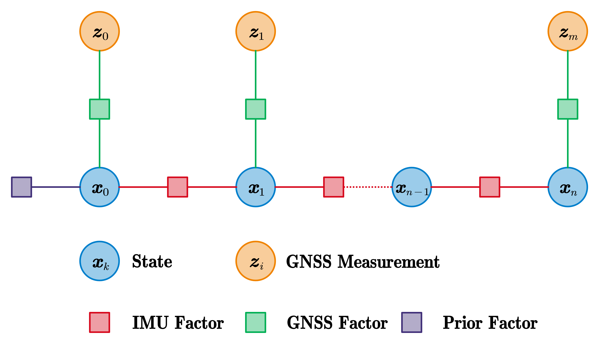

# OB_GINS

## Optimization-Based GNSS/INS Integrated Navigation System



We open-source OB_GINS, an optimization-based GNSS/INS integrated navigation system. The main features of OB_GINS are as follows:

- A sliding-window optimizer for GNSS/INS integration;

- Abstract IMU-preintegration implementation, including:
  - The normal IMU preintegration without the Earth's rotation consideration;
  - The normal IMU/ODO preintegration;
  - The refined IMU preintegration with the Earth's rotation consideration;
  - The refined IMU/ODO preintegration;
- Implementation of the marginalization;
- Tools for attitude parameterization and coordinate frames;
- Tools for file IO;

**Authors:** Hailiang Tang, Xiaoji Niu, and Tisheng Zhang from the [Integrated and Intelligent Navigation (i2Nav) Group](http://www.i2nav.com/), Wuhan University.

**Related Paper:**

- Hailiang Tang, Tisheng Zhang, Xiaoji Niu, Jing Fan, and Jingnan Liu, “Impact of the Earth Rotation Compensation on MEMS-IMU Preintegration of Factor Graph Optimization,” *IEEE Sensors Journal*, 2022.
- Le Chang, Xiaoji Niu, and Tianyi Liu, “GNSS/IMU/ODO/LiDAR-SLAM Integrated Navigation System Using IMU/ODO Pre-Integration,” *Sensors*, vol. 20, no. 17, p. 4702, Aug. 2020, doi: [10.3390/s20174702](https://doi.org/10.3390/s20174702).
- Junxiang Jiang, Xiaoji Niu, and Jingnan Liu, “Improved IMU Preintegration with Gravity Change and Earth Rotation for Optimization-Based GNSS/VINS,” *Remote Sensing*, vol. 12, no. 18, p. 3048, Sep. 2020, doi: [10.3390/rs12183048](https://doi.org/10.3390/rs12183048).

If you use this software for your academic research, please cite our related papers; and give acknowledgement like:

```
English version: “The authors would like to acknowledge Dr. Xiaoji Niu and the Integrated and Intelligent Navigation (i2Nav) group from Wuhan University for providing the OB_GINS software that was used in the paper.”
中文模板：“本文作者感谢武汉大学多源智能导航实验室和牛小骥教授开源的OB_GINS软件平台。”
```

**Contacts:**

- For any technique problem, you can send an email to Dr. Hailiang Tang (thl@whu.edu.cn).
- For Chinese users, we also provide a QQ group (**481173293**) for discussion. You are required to provide your organization and name.

## 1 Prerequisites

### 1.1 System and compiler

We recommend you use Ubuntu 18.04 or Ubuntu 20.04 with the newest compiler (**gcc>=8.0** or **clang>=6.0**).

```shell
# Ubuntu 18.04

# gcc-8
sudo apt install gcc-8 g++-8

# or clang
# sudo apt install clang
```

### 1.2 Ceres

We use Ceres Solver to solve the non-linear least squares problem. The supported version is **Ceres Solver 2.0.0 or 2.1.0**. Please follow [Ceres installation instructions](http://ceres-solver.org/installation.html).
### 1.3 Eigen3

The supported version is **Eigen 3.3.7~3.3.9**.

```shell
sudo apt install libeigen3-dev
```

### 1.4 yaml-cpp

```shell
sudo apt install libyaml-cpp-dev
```

## 2 Build OB_GINS and run demo

Once the prerequisites have been installed, you can clone this repository and build OB_GINS as follows:

```shell
# Clone the repository
git clone https://github.com/i2Nav-WHU/OB_GINS.git ~/

# Build OB_GINS
cd ~/OB_GINS
mkdir build && cd build

# gcc
cmake ../ -DCMAKE_BUILD_TYPE=Release -DCMAKE_C_COMPILER=gcc-8 -DCMAKE_CXX_COMPILER=g++-8
# clang
# cmake ../ -DCMAKE_BUILD_TYPE=Release -DCMAKE_C_COMPILER=clang -DCMAKE_CXX_COMPILER=clang++

make -j8

# Run demo dataset
cd ~/OB_GINS
./bin/ob_gins ./dataset/ob_gins.yaml

# Wait until the program finish
```

## 3 Datasets

### 3.1 Demo dataset

We offer a demo dataset with configuration file, which are located at **dataset** directory.

### 3.2 awesome-gins-datasets

One can find our open-source datasets at **[awesome-gins-datasets](https://github.com/i2Nav-WHU/awesome-gins-datasets)**.

### 3.3 Your own dataset

The data formats used in OB_GINS are the same as the formats defined at **[awesome-gins-datasets](https://github.com/i2Nav-WHU/awesome-gins-datasets)**. You can follow the formats to prepare your own datasets, or you can modify the source code as you need.

## 4 Acknowledgements

We thanks [VINS-Fusion](https://github.com/HKUST-Aerial-Robotics/VINS-Fusion) for providing a excellent platform for SLAM learners.

## 5 License

The source code is released under GPLv3 license.

We are still working on improving the code reliability. For any technical issues, please contact Hailiang Tang (thl@whu.edu.cn) or open an issue at this repository.

For commercial usage, please contact Prof. Xiaoji Niu (<xjniu@whu.edu.cn>).
